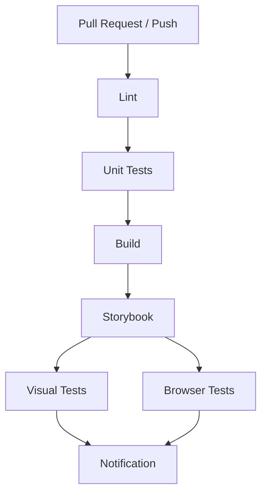
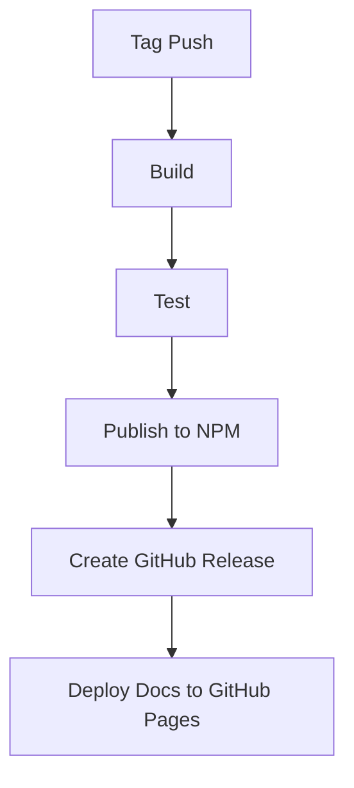

# Präsentation: Implementierung des Testplans für Smolitux UI

## Agenda

1. Überblick und Ziele
2. Implementierte Phasen
3. Erreichte Ergebnisse
4. CI/CD-Pipeline
5. Testabdeckung
6. Nächste Schritte
7. Fazit

---

## 1. Überblick und Ziele

### Projektziele

- Einrichtung einer soliden Testinfrastruktur
- Verbesserung der Komponenten-Qualität
- Erhöhung der Testabdeckung
- Integration einer CI/CD-Pipeline
- Erstellung einer umfassenden Dokumentation

### Ausgangssituation

- Fehlende Testinfrastruktur
- Unzureichende Komponenten-Qualität
- Keine CI/CD-Pipeline
- Unvollständige Dokumentation

---

## 2. Implementierte Phasen

### Phase 1: Testinfrastruktur-Setup (PR #2)

- Einrichtung von Jest und React Testing Library
- Konfiguration von TypeScript-Unterstützung
- Erstellung von Test-Utilities und Mocks
- Beispiel-Test für die Button-Komponente

### Phase 2: Komponenten-Refactoring (PR #3)

- Verbesserung der Button-Komponente
- Implementierung von Barrierefreiheits-Features
- Hinzufügung von forwardRef und memo
- Verbesserung der Keyboard-Navigation

### Phase 3: Unit-Tests (PR #4)

- Umfassende Unit-Tests für die Button-Komponente
- Tests für alle Varianten, Zustände und Interaktionen
- Tests für Barrierefreiheit und ARIA-Attribute
- Tests für Ref-Forwarding und Props-Durchreichung

### Phase 4: CI/CD-Integration (PR #5)

- GitHub Actions Workflows für CI und Release
- Playwright-Konfiguration für E2E-Tests
- Jest-Konfiguration mit JUnit-Berichten
- Codecov-Konfiguration

### Phase 5: Dokumentation (PR #6, #7, #8)

- Zusammenfassung der Implementierung
- Detaillierte Testabdeckung für die Button-Komponente
- Dokumentation der CI/CD-Integration
- Roadmap für die nächsten Schritte

---

## 3. Erreichte Ergebnisse

### Testinfrastruktur

- Vollständige Jest-Konfiguration mit TypeScript-Unterstützung
- Integration von React Testing Library für Komponenten-Tests
- Playwright für E2E-Tests
- Vorbereitung für visuelle Regressionstests mit Chromatic

### Komponenten-Qualität

- Verbesserte Button-Komponente als Referenzimplementierung
- Barrierefreiheit durch ARIA-Attribute und Keyboard-Navigation
- Performance-Optimierung durch Memoization
- Bessere Integration mit Form-Bibliotheken durch Ref-Forwarding

### Dokumentation

- Umfassende Dokumentation der Implementierung
- Detaillierte Testabdeckung für die Button-Komponente
- Dokumentation der CI/CD-Pipeline
- Roadmap für die nächsten Schritte

---

## 4. CI/CD-Pipeline

### CI-Workflow



### Release-Workflow



### Vorteile der CI/CD-Pipeline

- Automatische Tests bei jedem Pull Request
- Automatische Veröffentlichung bei Tags
- Testberichte und Testabdeckung
- Automatische Dokumentation

---

## 5. Testabdeckung

### Button-Komponente

- **Zeilen**: 100%
- **Anweisungen**: 100%
- **Funktionen**: 100%
- **Branches**: 100%

### Getestete Aspekte

- Alle Varianten (primary, secondary, outline, ghost, link)
- Alle Zustände (normal, disabled, loading)
- Alle Größen (xs, sm, md, lg)
- Interaktionen (Klick-Events, Keyboard-Navigation)
- Barrierefreiheit (ARIA-Attribute, Keyboard-Unterstützung)
- Integration mit Formularen

### Beispiel-Test

```tsx
test('renders in loading state correctly', () => {
  render(<Button loading>Loading</Button>);
  const button = screen.getByRole('button');
  
  expect(button).toBeDisabled();
  expect(button).toHaveClass('opacity-50');
  expect(button).toHaveClass('cursor-not-allowed');
  expect(button).toHaveAttribute('aria-busy', 'true');
  expect(screen.getByText('Loading...')).toBeInTheDocument();
  expect(screen.getByRole('button')).toContainElement(screen.getByText('Loading...'));
});
```

---

## 6. Nächste Schritte

### Kurzfristige Ziele (1-2 Monate)

- Erweiterung der Testabdeckung auf weitere Komponenten
  - Card-Komponente
  - Input-Komponente
  - Select-Komponente
- Integration von visuellen Regressionstests
- Erweiterung der Dokumentation

### Mittelfristige Ziele (3-6 Monate)

- Erweiterung der Komponenten-Bibliothek
- Performance-Optimierung
- Verbesserung der Barrierefreiheit

### Langfristige Ziele (6-12 Monate)

- Erweiterung um Diagramm-Komponenten
- Erweiterung um Layout-Komponenten
- Verbesserung des Themings und Stylings
- Internationalisierung

---

## 7. Fazit

### Erreichte Ziele

- ✅ Solide Testinfrastruktur eingerichtet
- ✅ Komponenten-Qualität verbessert
- ✅ Testabdeckung erhöht
- ✅ CI/CD-Pipeline integriert
- ✅ Umfassende Dokumentation erstellt

### Vorteile für das Projekt

- Höhere Codequalität
- Weniger Bugs und Regressionen
- Schnellere Entwicklung durch automatisierte Tests
- Bessere Dokumentation und Wartbarkeit
- Kontinuierliche Integration und Deployment

### Empfehlungen

- Test-Driven Development für neue Komponenten
- Fokus auf Barrierefreiheit und Performance
- Regelmäßige Überprüfung der Testabdeckung
- Kontinuierliche Verbesserung der Dokumentation

---

## Vielen Dank!

### Fragen?

Kontakt: [team@smolitux.de](mailto:team@smolitux.de)

### Ressourcen

- [GitHub Repository](https://github.com/EcoSphereNetwork/smolitux-ui)
- [Dokumentation](https://ecospherenetwork.github.io/smolitux-ui)
- [NPM Packages](https://www.npmjs.com/org/smolitux)